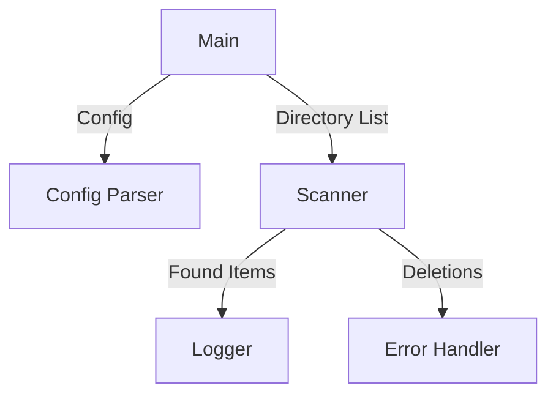

# Developer Notes

[Tech Stack](#tech-stack) | [Architecture](#architecture) | [Workflows](#workflows) | [Templates](#templates) | [Contributing](#contributing)

## Tech Stack

Core Technologies

| Technology | Purpose | Version |
|------------|---------|---------|
| Rust | Main Language | stable |
| Clap | CLI Parser | 2.x |
| Serde | Serialization | latest |
| Log | Logging | latest |

## Architecture

## Templates

> [!NOTE]
> All templates use standardized formats for consistency

Template Structure

- Issues
  - Bug Report
  - Feature Request
  - Question
- Pull Requests
  - Feature
  - Bug Fix
  - Documentation

## Environment Detection

- By default, dep_cleaner checks the `dependency_directories` specified in config.
- To support new environments, simply add folder names, e.g. "my_custom_env", to `dependency_directories`.
- The scanning logic in `main.rs` and `process_directory` will recursively detect these.

## Workflows
- The `.github/workflows/ci.yml` script runs on each push or pull request.
- It checks code formatting, lints for warnings, runs the test suite, and uploads coverage data.
- Ensures consistent quality and offers immediate feedback on proposed changes.
